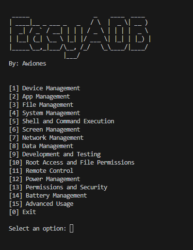

# EasyADB

<p align="center">

</p>

**EasyADB** is a command-line tool designed to simplify the use of Android Debug Bridge (ADB) commands. It provides a user-friendly interface where users can execute ADB commands without the need to remember complex syntax. With EasyADB, you can manage Android devices, apps, files, and more simply by selecting options from a menu.

## Why EasyADB?

Managing Android devices through ADB can be daunting for those who are not familiar with command-line tools. Remembering the syntax and options for different ADB commands can be challenging. **EasyADB** aims to make this process easier by providing a menu-driven interface, allowing you to execute various ADB commands by just pressing numbers and hitting Enter.

## Note

**This repository is designed to work on Windows only.** 

## Features

EasyADB includes a wide range of features organized into different sections:

1. **Device Management**
   - List all connected Android devices and emulators
   - Connect to a device over Wi-Fi
   - Disconnect from a device
   - Pair a device with ADB over Wi-Fi

2. **App Management**
   - Install an APK file
   - Uninstall an app
   - Install multiple APKs (for split APKs)
   - Reinstall an app, keeping its data

3. **File Management**
   - Copy files between the host machine and the device
   - Delete files on the device

4. **System Management and Debugging**
   - Stream system logs
   - Save logs to a file
   - Generate bug reports
   - Display real-time system processes

5. **Shell and Command Execution**
   - Start an interactive shell
   - Run specific shell commands
   - List installed packages
   - Uninstall packages via the shell

6. **Screen Management**
   - Take screenshots
   - Record the screen to a video file
   - Get or set the screen resolution and density

7. **Network Management**
   - Forward local ports to remote ports
   - Display network interface configurations
   - Enable or disable airplane mode and Wi-Fi

8. **Data Management**
   - Create and restore full backups
   - Clear app data for specific packages

9. **Development and Testing**
   - Run stress tests
   - Simulate user input
   - Manage device settings programmatically

10. **Root Access and File Permissions**
    - Restart the adbd daemon with root privileges
    - Change file permissions
    - Remount system partitions as writable

11. **Remote Control**
    - Send key events (e.g., home, back)
    - Simulate taps and swipes

12. **Power Management**
    - Reboot the device
    - Reboot into bootloader or recovery mode
    - Power off the device

13. **Permissions and Security**
    - Grant or revoke app permissions
    - Manage device policies

14. **Battery Management**
    - Dump the current battery status
    - Set and reset battery levels

15. **Advanced Usage**
    - Wait for the device to be connected
    - Enter superuser mode
    - Get and set device properties

## Getting Started

### Prerequisites

- Python 3.x
- ADB (Android Debug Bridge) installed and included in the `platform-tools` directory
- Windows operating system

### Installation

1. Clone this repository:
```bash
git clone https://github.com/yourusername/EasyADB.git
```
2. Navigate to the project directory:
 ```bash
 cd EasyADB
 ```
3. Ensure the `platform-tools` folder containing ADB is inside the project directory.

### Usage

1. Connect your Android device to your computer via USB.
2. Run the `main.py` script:
```bash
python main.py
```
3. Follow the on-screen instructions to select and execute ADB commands using the menu options.

### Example

To install an APK on a connected device:

1. Run `main.py`.
2. Select the "App Management" option by entering the corresponding number.
3. Select "Install an APK file on the connected device."
4. Follow the prompts to complete the installation.

## Screenshots



## Contributing

Contributions are welcome! If you have suggestions, improvements, or bug fixes, please submit a pull request or open an issue.

- **Fork the Repository**: Create a personal copy of the repository on GitHub.
- **Make Changes**: Implement your changes and test them locally.
- **Submit a Pull Request**: Describe your changes and submit a pull request for review.


## License

This project is licensed under the MIT License. See the [LICENSE](LICENSE) file for details.

## Acknowledgments

- [Android Developers - ADB Documentation](https://developer.android.com/studio/command-line/adb)
- Thanks to all contributors for making ADB usage easier!

---

With EasyADB, managing Android devices is now a breeze. Say goodbye to complicated command-line syntax and hello to simplicity. Just press a number and hit Enter!

### Notes:
- This version specifies that the tool is designed to work on Windows only.
- Make sure to add the repository link in the "Installation" section.
- Feel free to customize further if you want to include more details or instructions specific to your implementation.


---

Made with ❤️ by Awiones
